```r
D1<-gapminder %>% filter(country!="Kuwait")

library(tidyverse)
```

## Background

_Place Task Background Here_

## Data Wrangling


```r
# Use this R-Chunk to clean & wrangle your data!

##Plan
#Make a Color Palette for Contitnet
#Make a uhh how do I amke popualtion data points?
#make graphs for each year or several years

Y52<-D1 %>% filter(year=="1952")
Y57<-D1 %>% filter(year=="1957")
Y62<-D1 %>% filter(year=="1962")
Y67<-D1 %>% filter(year=="1967")
Y77<-D1 %>% filter(year=="1977")
Y82<-D1 %>% filter(year=="1982")
Y87<-D1 %>% filter(year=="1987")
Y92<-D1 %>% filter(year=="1992")
Y97<-D1 %>% filter(year=="1997")
Y02<-D1 %>% filter(year=="2002")
Y07<-D1 %>% filter(year=="2007")
#make seperate plots for years and then have them displayed side by side.


  Y52P <- ggplot(Y52, aes(lifeExp, gdpPercap, size = pop,colour = factor(Y52$continent))) + geom_point() + scale_y_continuous(trans = "sqrt") + labs(x = "Life Expectancy") + labs(y="GDP Per Capita")
  Y52P2<-Y52P + labs(color="Continents", size="Population") +ggtitle("1952")
  
    Y57P <- ggplot(Y57, aes(lifeExp, gdpPercap, size = pop,colour = factor(Y57$continent))) + geom_point() + scale_y_continuous(trans = "sqrt") + labs(x = "Life Expectancy") + labs(y="GDP Per Capita")
    Y57P2<-Y57P + labs(color="Continents", size="Population") +ggtitle("1957")
    
    
    
      Y62P <- ggplot(Y62, aes(lifeExp, gdpPercap, size = pop,colour = factor(Y62$continent))) + geom_point() + scale_y_continuous(trans = "sqrt") + labs(x = "Life Expectancy") + labs(y="GDP Per Capita")
      Y62P2<-Y62P + labs(color="Continents", size="Population") +ggtitle("1962")
      
        Y77P <- ggplot(Y77, aes(lifeExp, gdpPercap, size = pop,colour = factor(Y77$continent))) + geom_point() + scale_y_continuous(trans = "sqrt") + labs(x = "Life Expectancy") + labs(y="GDP Per Capita")
        Y77P2<-Y77P + labs(color="Continents", size="Population") +ggtitle("1977")
        
          Y82P <- ggplot(Y82, aes(lifeExp, gdpPercap, size = pop,colour = factor(Y82$continent))) + geom_point() + scale_y_continuous(trans = "sqrt") + labs(x = "Life Expectancy") + labs(y="GDP Per Capita")
          Y82P2<-Y82P + labs(color="Continents", size="Population") +ggtitle("1982")
          
            Y87P <- ggplot(Y87, aes(lifeExp, gdpPercap, size = pop,colour = factor(Y87$continent))) + geom_point() + scale_y_continuous(trans = "sqrt") + labs(x = "Life Expectancy") + labs(y="GDP Per Capita")
            Y87P2<-Y87P + labs(color="Continents", size="Population") +ggtitle("1987")
            
              Y92P <- ggplot(Y92, aes(lifeExp, gdpPercap, size = pop,colour = factor(Y92$continent))) + geom_point() + scale_y_continuous(trans = "sqrt") + labs(x = "Life Expectancy") + labs(y="GDP Per Capita")
              Y92P2<-Y92P + labs(color="Continents", size="Population") +ggtitle("1992")

Y97P <- ggplot(Y97, aes(lifeExp, gdpPercap, size = pop,colour = factor(Y97$continent))) + geom_point() + scale_y_continuous(trans = "sqrt") + labs(x = "Life Expectancy") + labs(y="GDP Per Capita")
Y97P2<-Y97P + labs(color="Continents", size="Population") +ggtitle("1997")


Y02P <- ggplot(Y02, aes(lifeExp, gdpPercap, size = pop,colour = factor(Y02$continent))) + geom_point() + scale_y_continuous(trans = "sqrt") + labs(x = "Life Expectancy") + labs(y="GDP Per Capita")
Y02P2<-Y02P + labs(color="Continents", size="Population") +ggtitle("2002")

Y07P <- ggplot(Y07, aes(lifeExp, gdpPercap, size = pop,colour = factor(Y07$continent))) + geom_point() + scale_y_continuous(trans = "sqrt") + labs(x = "Life Expectancy") + labs(y="GDP Per Capita")
Y07P2<-Y07P + labs(color="Continents", size="Population") +ggtitle("2007")

par(mfrow=c(1,10))
Y52P2
```

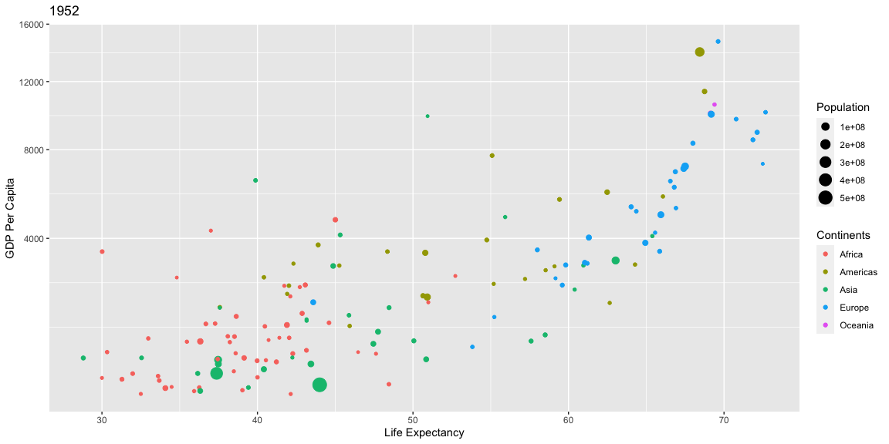<!-- -->

```r
Y57P2
```

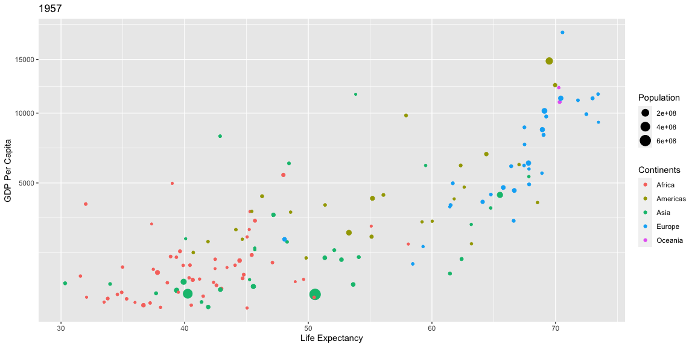<!-- -->

```r
Y62P2
```

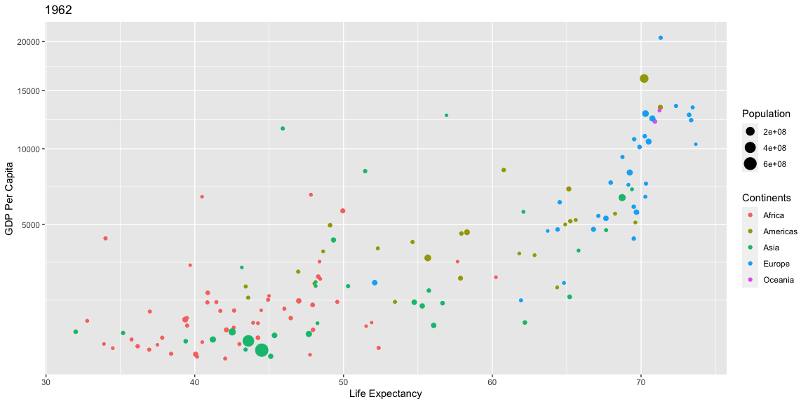<!-- -->

```r
Y77P2
```

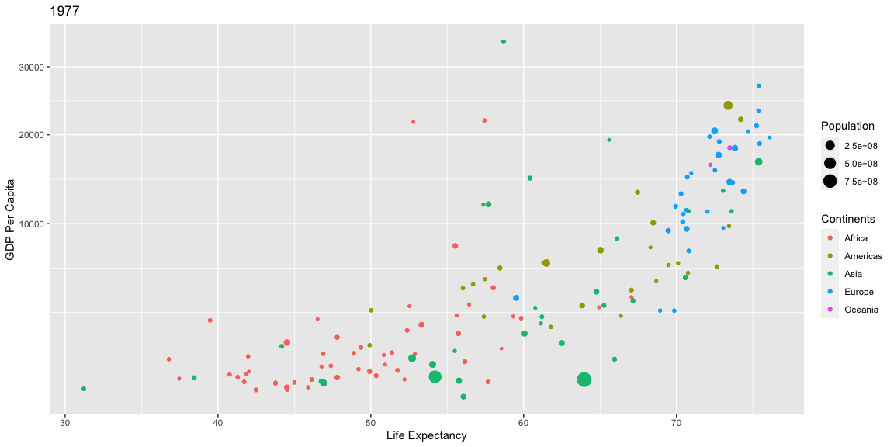<!-- -->

```r
Y82P2
```

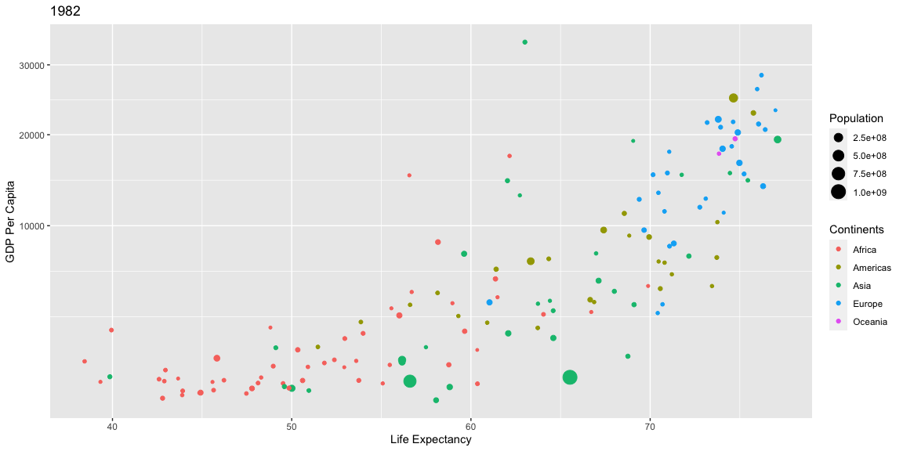<!-- -->

```r
Y87P2
```

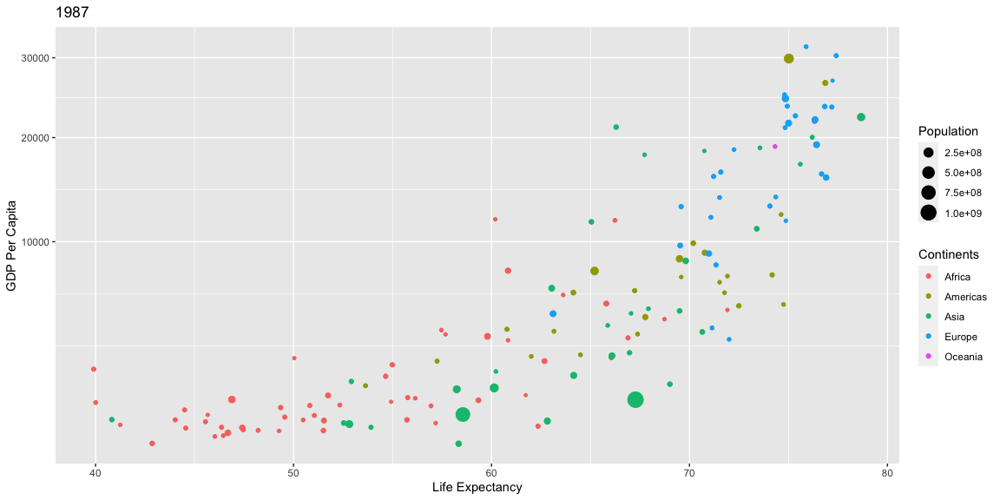<!-- -->

```r
Y92P2
```

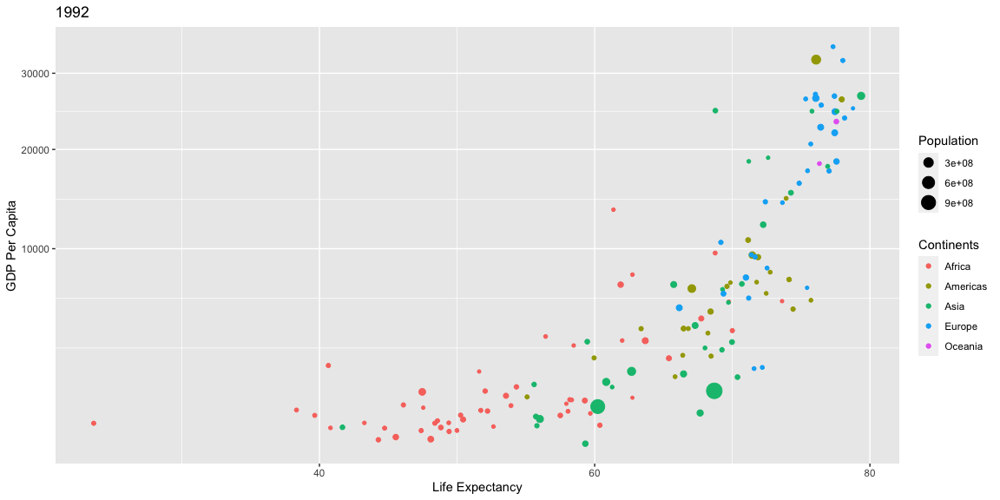<!-- -->

```r
Y97P2
```

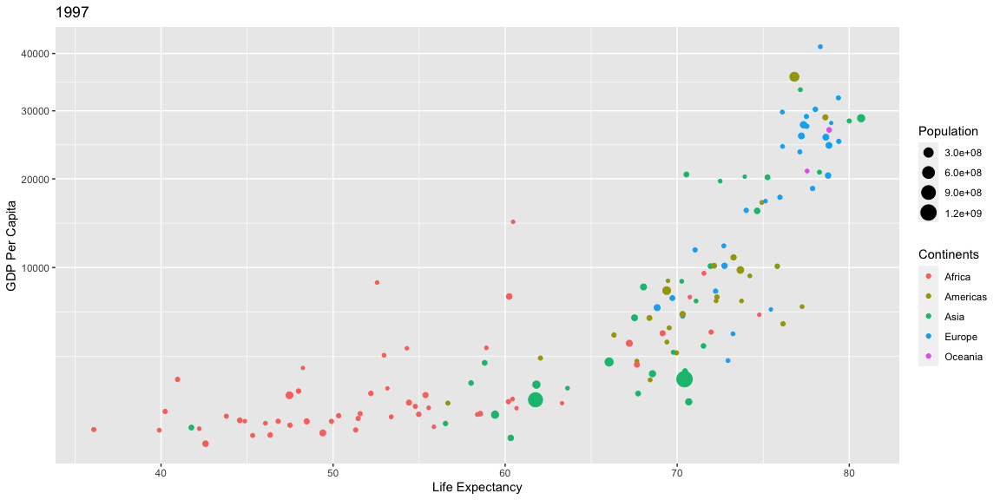<!-- -->

```r
Y02P2
```

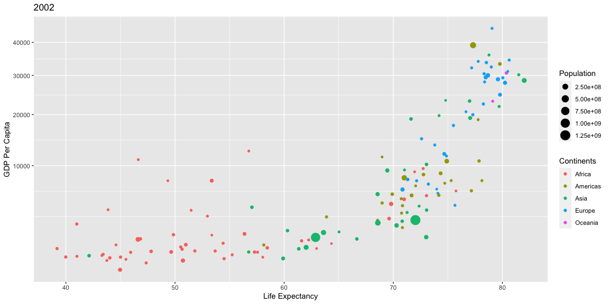<!-- -->

```r
Y07P2
```

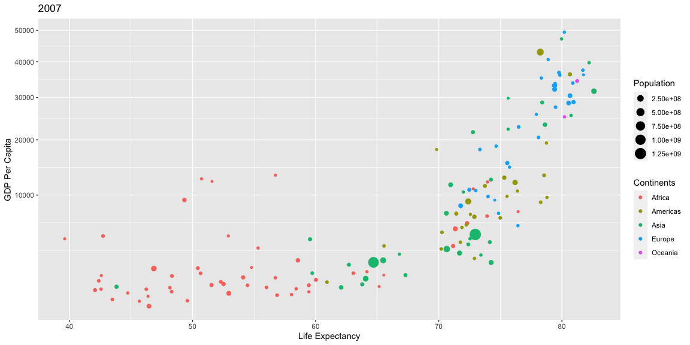<!-- -->

## Data Visualization


```r
# Use this R-Chunk to plot & visualize your data!


  #Y52P <- ggplot(Y52, aes(lifeExp, gdpPercap, size = pop,colour = factor(Y52$continent))) + geom_point() + scale_y_continuous(trans = "sqrt") + labs(x = "Life Expectancy") + labs(y="GDP Per Capita")
  
#Y52P2<-Y52P + labs(color="Continents", size="Population") +ggtitle("1952")
#Y52P2

#Left to do
#fix population scaling
#make plots of other
#Combine Graphs


#par(mfrow=c(1,12))

#pal<-palette(c("red","orange1","yellow1","green1","blue1"))

#ggsave()
```


```r
 Plot1<- ggplot(data = D1, aes(x = lifeExp, y = gdpPercap, color = continent, size = pop)) +
 theme_bw() +
  scale_y_continuous(trans = "sqrt")+
  geom_point() +
  facet_wrap(~D1$year) +
  labs(size = "Population(100k)")
Plot1
```

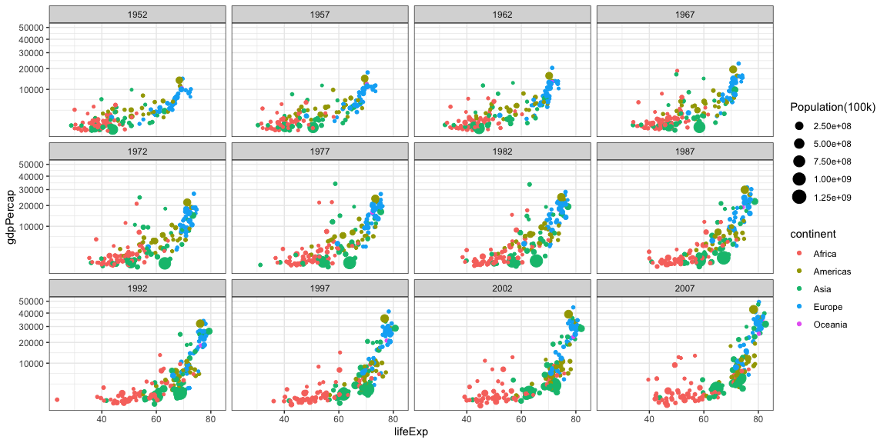<!-- -->

```r
ggsave("CaseStudy1.png", Plot1, width=15)
```


## Conclusions
