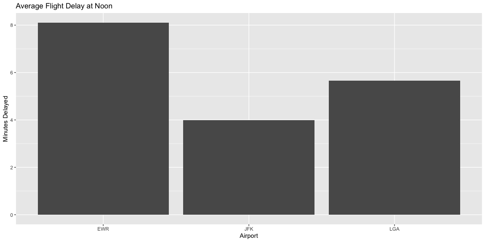
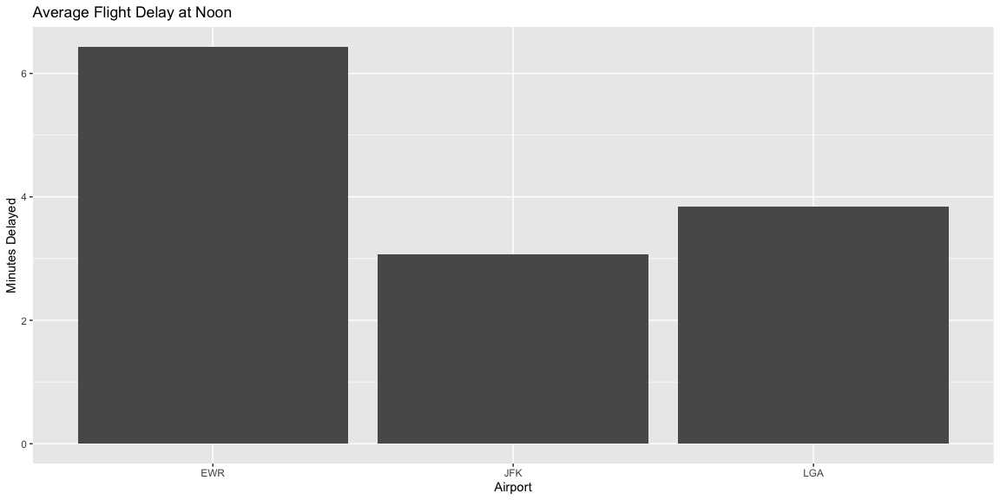
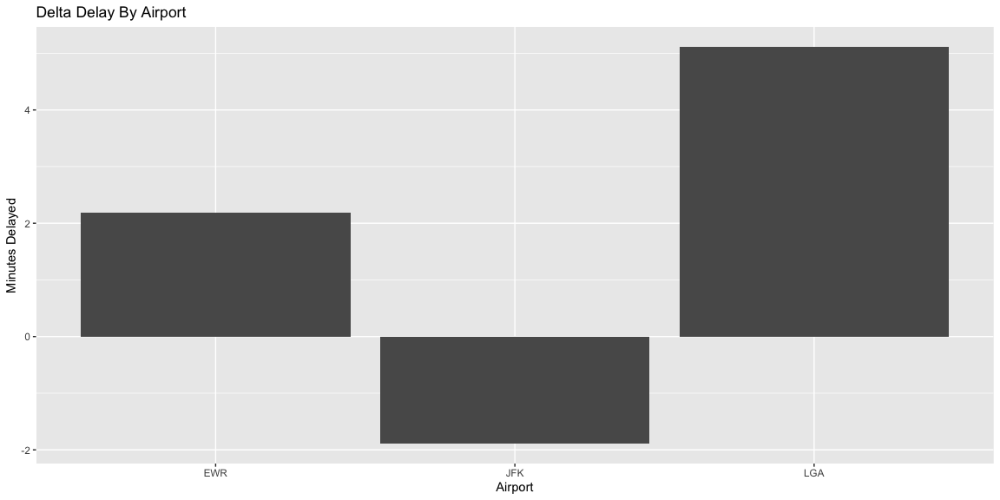
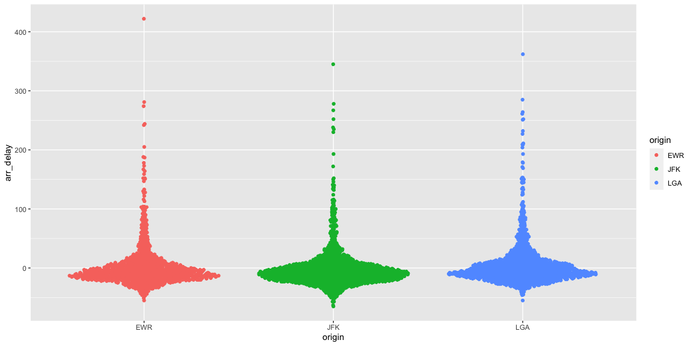
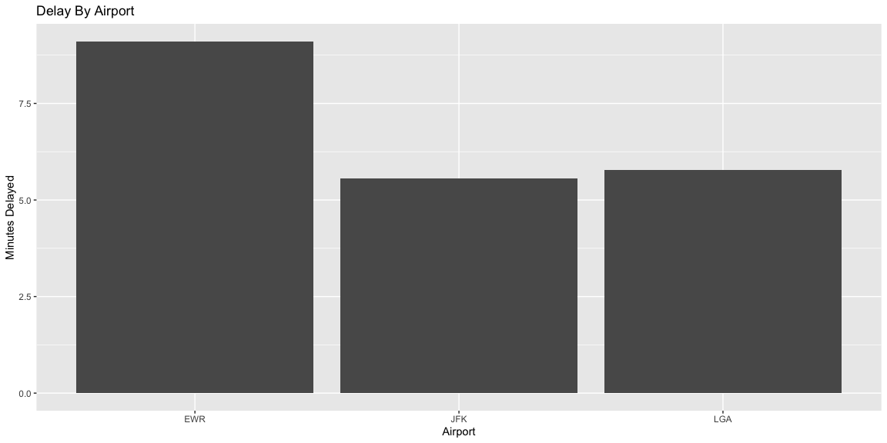

## Question 1

***Which airport has the two lowest Delay times at Noon?***


```r
# Use this R-Chunk to import all your datasets!
#If I am leaving before noon, which two airlines do you recommend at each airport (JFK, LGA, EWR) that will have the lowest delay time at the 75th percentile?
#Which origin airport is best to minimize my chances of a late arrival when I am using Delta Airlines?

f1<-filter(flights, origin=="JFK" | origin=="LGA" | origin=="EWR")

noon<-filter(f1, sched_dep_time==1200)

noon<-na.omit(noon)

#mean of the delay time, pick two lowest.

##so why is this empty?
f2<-noon %>% group_by(origin) %>% mutate(AverageDelay = mean(dep_delay))


ggplot(f2, aes(x=factor(origin), y=dep_delay), color = origin) + stat_summary(fun="mean", geom="bar")+
  xlab("Airport")+
  ylab("Minutes Delayed")+
  ggtitle("Average Flight Delay at Noon")
```

<!-- -->

```r
#So geom_col adds everything...
```

On Averages, JFK has the smallest delay tie, and LGA is not far behind it only being about a minute and a half longer.
EWR has a delay time on average of 8 minutes.  The data set is large enough that the major outliers are nicely accounted for. But we could still try and remove the outliers.


```r
f3<-f2 %>% filter(dep_delay<200 | dep_delay<(-200))
ggplot(f3, aes(x=factor(origin), y=dep_delay), color = origin) + stat_summary(fun="mean", geom="bar")+
  xlab("Airport")+
  ylab("Minutes Delayed")+
  ggtitle("Average Flight Delay at Noon")
```

<!-- -->

```r
f4<-f2 %>% filter(dep_delay>200 | dep_delay<(-200))
```

Removing the outliers of anything less than 200 minutes or in other words anything less than over 2 hours which is very rare. There only 26 greater than 200 minutes on either side.

96 over 100 or under -100.  

Removing these 2 percent of cases.  Does not change the trends in the data, but it does lower the averages.

Still JFK, LGA are the two lowest average delay times at noon.

## Question 2
***Best Airport For Delta***

```r
# Use this R-Chunk to clean & wrangle your data!
#Which origin airport is best to minimize my chances of a late arrival when I am using Delta Airlines?


delta<-filter(f1, carrier=="DL")

delta<-na.omit(delta)

delta<-noon %>% group_by(origin) %>% mutate(AveArrivaldelay = mean(arr_delay))


ggplot(delta, aes(x=factor(origin), y=arr_delay), color = origin) + stat_summary(fun="mean", geom="bar")+
  xlab("Airport")+
  ylab("Minutes Delayed")+
  ggtitle("Delta Delay By Airport")
```

<!-- -->

In JFK, Delta flights on average arrive 2 minutes early.  Suggesting it has the lowest risk of arriving late by virture of arriving early most of the time.    


```r
library(ggbeeswarm)
 ggplot(delta, mapping=aes(origin, arr_delay)) + geom_quasirandom(aes(color=origin))
```

<!-- -->

Using a Beeswarm we can see there is a health dose of flights that arrive a few minutes early with only some serious outliers towards the upper end of the spectrum.  


## Question 3
***A Challenge***
***"Which Destination Airport is the Worst For Arrival***

```r
##Which destination airport is the worst (you decide on the metric for worst) airport for arrival time?
  
late<-f1
late<-na.omit(late)

ggplot(late, aes(x=factor(origin), y=arr_delay), color = origin) + stat_summary(fun="mean", geom="bar")+
  xlab("Airport")+
  ylab("Minutes Delayed")+
  ggtitle("Delay By Airport")
```

<!-- -->

On average it seems only EWR is significantly differnt in lateness averageing 7 and half minutes for lateness, it only shows 

