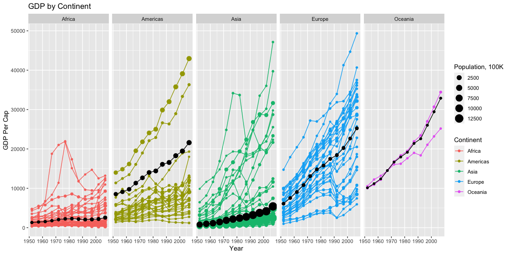
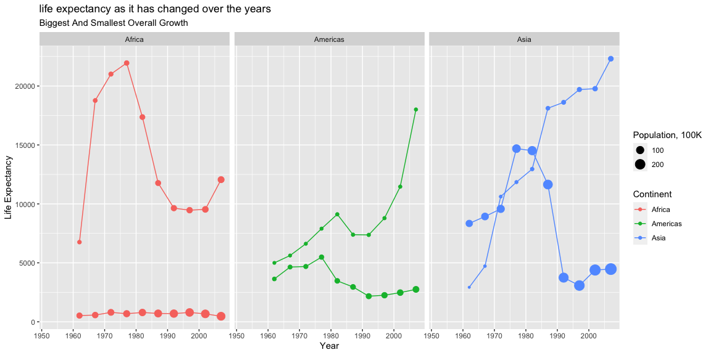

```r
# Use this R-Chunk to import all your datasets!

g1<-gapminder %>% filter(country!="Kuwait")
g1<-g1%>% group_by(year, continent) %>%
mutate(averageGDPPercap=weighted.mean(gdpPercap, pop))


g2<- g1 %>% group_by(country, continent)


g2<-filter(g1, continent == "Africa" | continent == "Americas" | continent ==  "Asia")
g2<-filter(g2, year>=1960)


#mutate the first frmo the last.  

g3 <-g2 %>% group_by(country, continent) %>% mutate(Change=tail(lifeExp,1) - head(lifeExp,1))

g3<-g3 %>% group_by(continent) %>% filter(year==max(year) | year == min(year)) %>% filter(Change==max(Change)| Change==min(Change)) %>% filter(year>1962)


g4 <- filter(g2,country %in% g3$country)
```

## Background

_Place Task Background Here_

## Data Wrangling


```r
# Use this R-Chunk to clean & wrangle your data!
```

## Data Visualization


```r
# Use this R-Chunk to plot & visualize your data!

p1<-ggplot() + geom_point(data=g1, aes(x=year, y=gdpPercap, color=continent, size=pop/100000)) + scale_x_continuous(name="Year", limits=c(1952, 2007)) +
  geom_line(g1, mapping=aes(x=year,y=gdpPercap, group=country, color=continent))+
   geom_point(data=g1, aes(x=year, y=averageGDPPercap, size=pop/100000),color="black")+
  geom_line(data=g1, aes(x=year, y=averageGDPPercap),color="black")+
ylab("GDP Per Cap")+
xlab("Year")+
  labs(color= "Continent", size="Population, 100K")+
  ggtitle("GDP by Continent")+
  facet_grid(~continent)

 
p1
```

<!-- -->

```r
p4<-ggplot() + geom_point(data=g4, aes(x=year, y=gdpPercap, color=continent, size=pop/100000)) + scale_x_continuous(name="Year", limits=c(1952, 2007)) +
  geom_line(g4, mapping=aes(x=year,y=gdpPercap, group=country, color=continent))+
ylab("Life Expectancy")+
xlab("Year")+
  labs(color= "Continent", size="Population, 100K", subtitle="Biggest And Smallest Overall Growth")+
  ggtitle("life expectancy as it has changed over the years")+
  facet_grid(~continent)

p4
```

<!-- -->

## Conclusions
