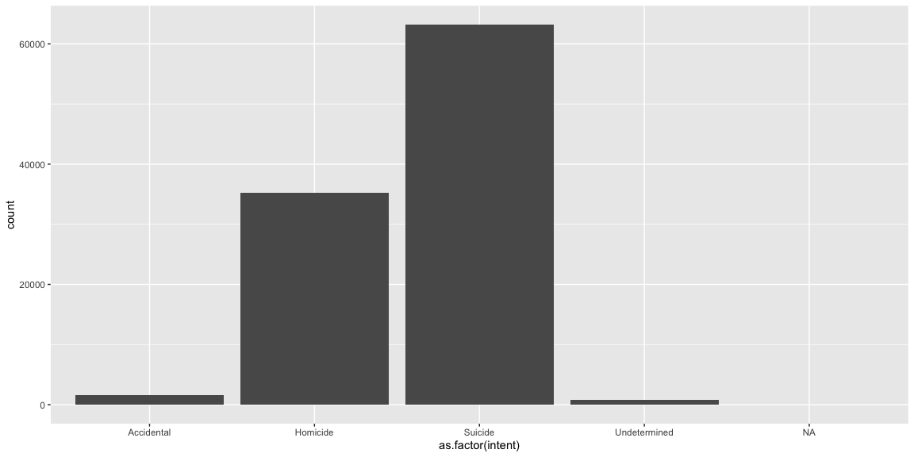
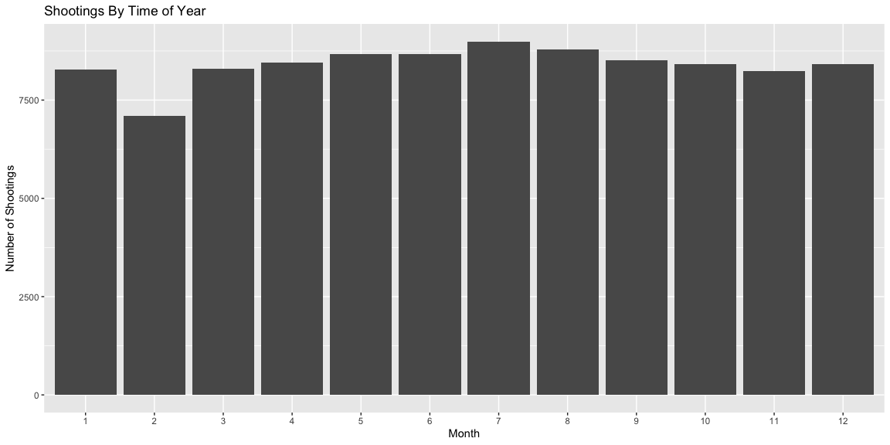
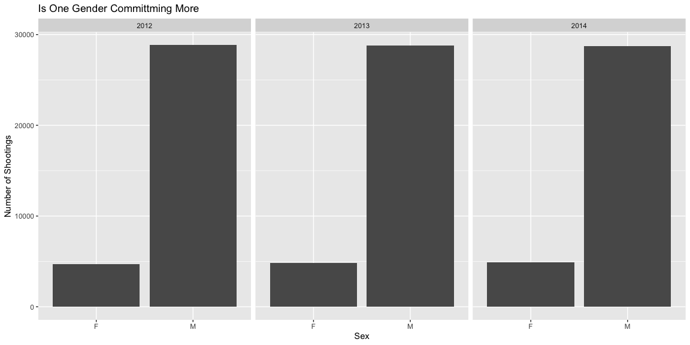
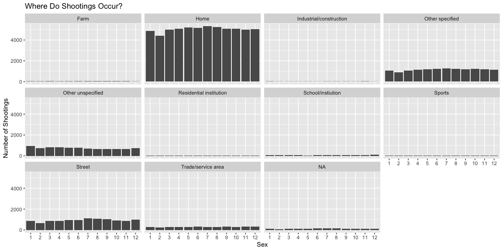
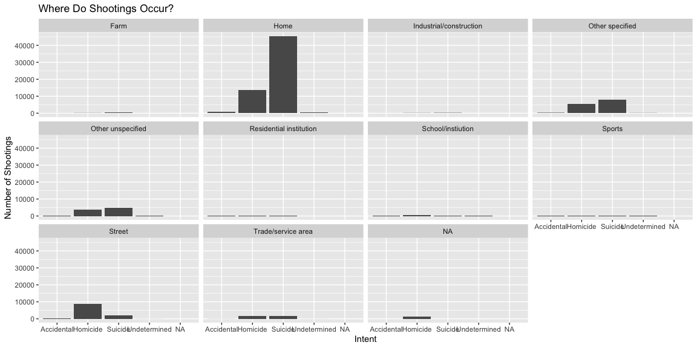
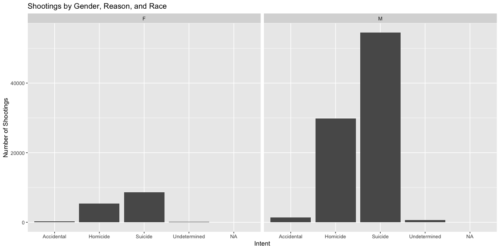
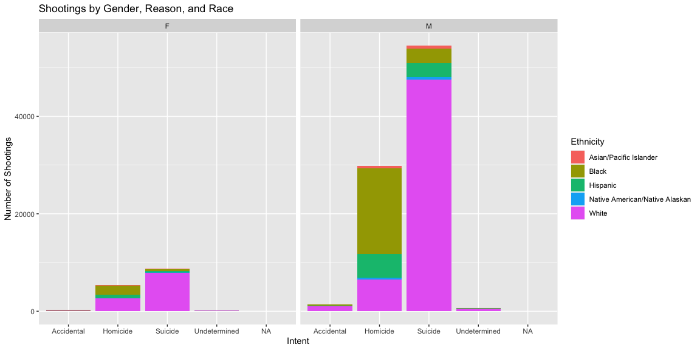
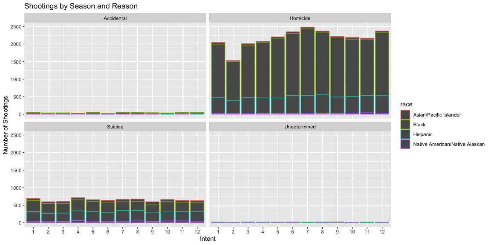
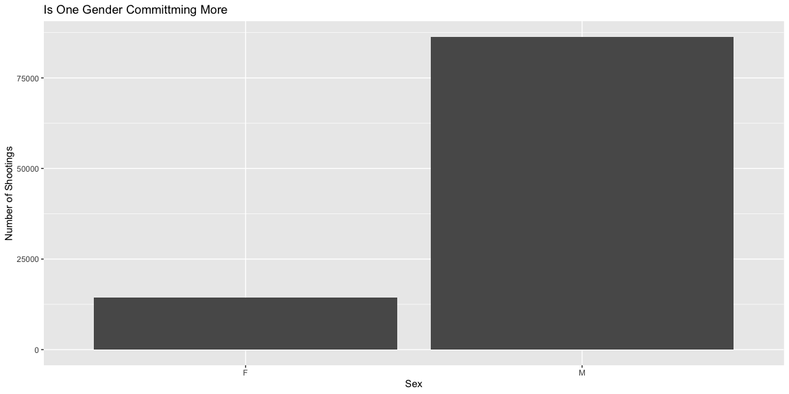

```r
# Use this R-Chunk to import all your datasets!

bob<-tempfile()
download.file("https://github.com/fivethirtyeight/guns-data/blob/master/full_data.csv?raw=true",destfile=bob,mode= "wb")
Shooting<-read.csv(bob)


#While their visualizations focused on yearly averages, our client wants to create commercials that help reduce the gun deaths in the US. They would like to target the commercials in different seasons of the year (think month variable) to audiences that could have the most impact in reducing gun deaths. Our challenge is to summarize and visualize seasonal trends accros the other variables in these data.
```

## Background

_Place Task Background Here_

## Data Wrangling


```r
# Use this R-Chunk to clean & wrangle your data!
```

## Data Visualization

#### Why Do They Do It?

```r
ggplot(data=Shooting, aes(x=as.factor(intent)))+geom_bar()
```

<!-- -->

Overwhelmingly the intent for shootings is Suicide.


#### When Do They Happen


```r
# Use this R-Chunk to plot & visualize your data!

ggplot(data=Shooting, aes(x=as.factor(month)))+geom_bar()+
  labs(x="Month", title="Shootings By Time of Year", y="Number of Shootings")
```

<!-- -->


```r
ggplot(data=Shooting, aes(x=as.factor(sex)))+geom_bar()+
  labs(x="Sex", title="Is One Gender Committming More", y="Number of Shootings")+
  facet_wrap(~year)
```

<!-- -->

```r
ggplot(data=Shooting, aes(x=as.factor(month)))+geom_bar()+
  labs(x="Sex", title="Where Do Shootings Occur?", y="Number of Shootings")+
  facet_wrap(~place)
```

<!-- -->

The Shootings are Overwhelmingly Happening in homes.  Now this is interesting.  However before we go about saying we just need more arms at home for self defense, the intent is important to take in mind.  Look at this.


```r
ggplot(data=Shooting, aes(x=as.factor(intent)))+geom_bar()+
  labs(x="Intent", title="Where Do Shootings Occur?", y="Number of Shootings")+
  facet_wrap(~place)
```

<!-- -->

The Middle Bar is Suicide. So the problem with Gun Deaths is at home suicides.  The issue is that people are choosing to harm themselves.  Now what is important here is self harm rather than an external threat.  The matter of suicide is a serious matter.  A disection of suicide data would confirm or refute the commonality of guns as a cause of sucidie however, it seems that of gun deaths sucicides are overwhelmingly the cause.

Now its interesting to consider one other thing.  Initially when I considered men were the most common gun deaths, however the overwhemling number is that Suicides at home by males are the leading cause of gun death.  Meanming nearly twice as many men are using guns merely to commit suicide.  In this case merely blaming the tool for the cause is short sighted in that the tool used for Suicide is not the cause of it, and a man decided determined to find a way to kill themselve will do so regardless of having access to a gun or not.


## The Most in One


```r
ggplot(data=Shooting, aes(x=as.factor(intent), color=race))+geom_bar()+
  labs(x="Intent", title="Shootings by Gender, Reason, and Race", y="Number of Shootings")+
  facet_wrap(~sex)+
  labs(color="Ethnicity")
```

<!-- -->

This is the best Vizualization of the bunch in a single graph, intent, race and sex are all shown.

We see that white males are overwhelmingly more likely to commit sucide than anyone else. And that Blacks are using Guns for Homicide more than anyone else.  It seems the greatest issues exisit among the white population with sucicide and the black population with homicide.  The causes of either are speculation using this data set, but the fact remains that those two ethnicitys in the US population have this problem.  If it were merely a matter of numbers then we'd expect whites to be the largest in every category.  But its not.  This is interesting.  


## Seasons 


```r
ggplot(data=Shooting, aes(x=as.factor(month), color=race))+geom_bar()+
  labs(x="Intent", title="Shootings by Season and Reason", y="Number of Shootings")+
  facet_wrap(~intent)
```

<!-- -->

This last graphs shows reason by the season. From it we can conclude there is no "season" for any shootings until we look at Christmas.

Christmas!  Christmas drops suicide.  A time of goodwill, celebration, focusong on Chrisitain spirit, giving, prolonged celebration, happiness and making others happy.  It is the time of the spirit of Christ.  There is a drop in the suicide rate among whites consistently from August to December. This seems to be overwhelming a white thing.  Whites sucidie rate drops in the middle of winter.  The cold, dark lonely winter and yet this is the time of year we have the lowest rate of suicide why?

But the story doesnt end there.  The rate spikes in Januaray, dead of winter, unrealized Christmas expectaions perhaps? The reason is unclear but in Feburary Sucides drop to their lowest rate of the entire year.  Little reason to guess why, Valintines day accounts for the drop, I dont think its Presidents day.  As little people accutally consider the Presidents of reasons to continue.  But in Feburary suicides are at their record low.  It doesnt take a PHD to guess its valintines day. Though this remains unconfirmed, there is little else that happens in that month.  The anticipation of finding love hoping for it seems to be enough for many to stave off suicide for another month.  Those who otherwise would that month find solaste in romance.  Or the expecation of romance.   


```r
nonwhite<-Shooting %>% filter(race!="White")

ggplot(data=nonwhite, aes(x=as.factor(month), color=race))+geom_bar()+
  labs(x="Intent", title="Shootings by Season and Reason", y="Number of Shootings")+
  facet_wrap(~intent)
```

<!-- -->

As the above graph shows, when Whites are removed from the equation suicide remains the same for every other race. What's interesting is the fall has the greatest reduction in sucidie rate among whites.  Perhaps this is the time of year for whites there are the most holidays.  Halloween, Thanksgiving, Christmas.  But these all are things enjoyed by every other race.


#### Who's 


```r
ggplot(data=Shooting, aes(x=as.factor(sex)))+geom_bar()+
  labs(x="Sex", title="Is One Gender Committming More", y="Number of Shootings")
```

<!-- -->


## Conclusions

This little plot shows alot of everything.  Number of Shootings, their gender, their motives, and their race all in one plot.  Black homicides are over represented, proportionally, however the overwheling number of white gun deaths are from suicide.  

Im keeping the progression to show how I came to this conclusion question.

This shows that Whites are more committing sucidie in their homes, and Blacks are shooting one another.

The unique causes of these two issues are their own.  It seems Whites could learn a thing or two about whatever it is that is causing leading to suicide and blacks could learn something from what it takes to avoid homicide from well, everyone else.  

Now this shows another smaller side note, men are more likely to die from gun violence than woman.  Overwhemlingly.  

Also the last point here, there seems to be no deliantion between time of death and gun deaths seeming continious.
