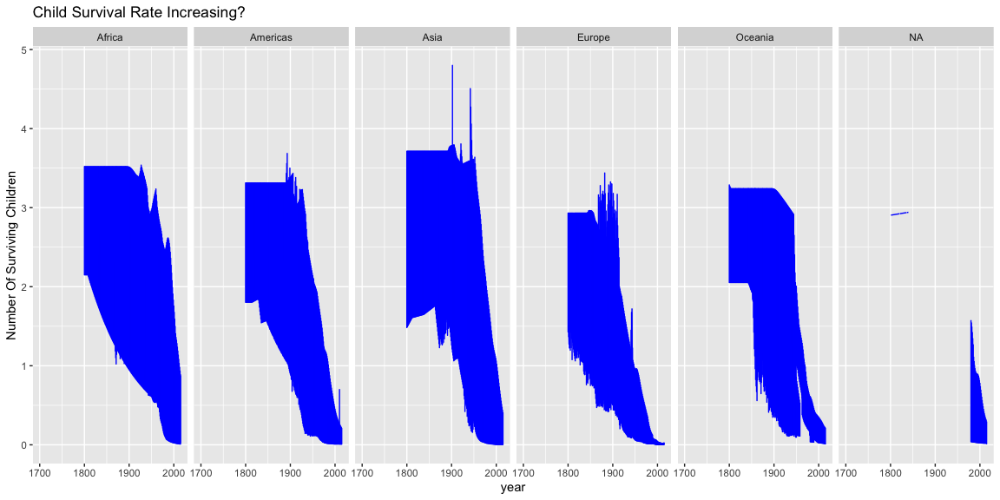

```r
# Use this R-Chunk to import all your datasets!
c1<-child_mortality

 
   ggplot(c1, aes(x=year, y=(deaths_per_woman), color = continent)) +
 geom_line(color="blue")+
  ylab("Number Of Surviving Children")+
  ggtitle("Child Survival Rate Increasing?")+
     facet_grid(~continent)
```

<!-- -->

```r
## Idea Geom point faceted by continet 
```

## Background

_Place Task Background Here_

## Data Wrangling


```r
# Use this R-Chunk to clean & wrangle your data!
```

## Data Visualization


```r
# Use this R-Chunk to plot & visualize your data!
```

## Conclusions
