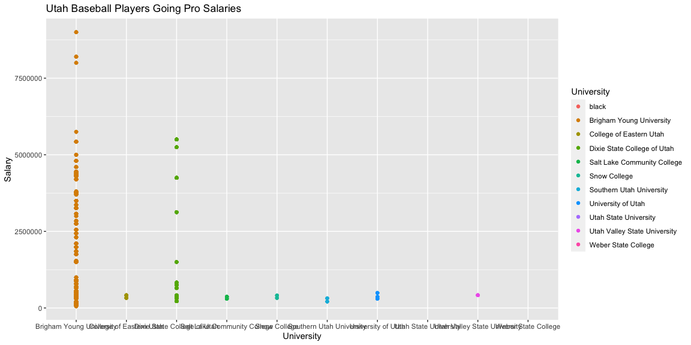
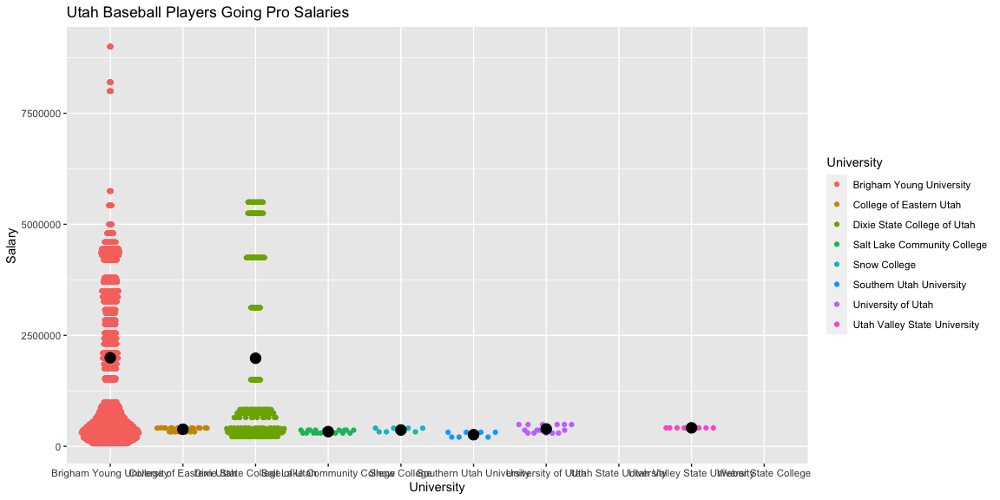
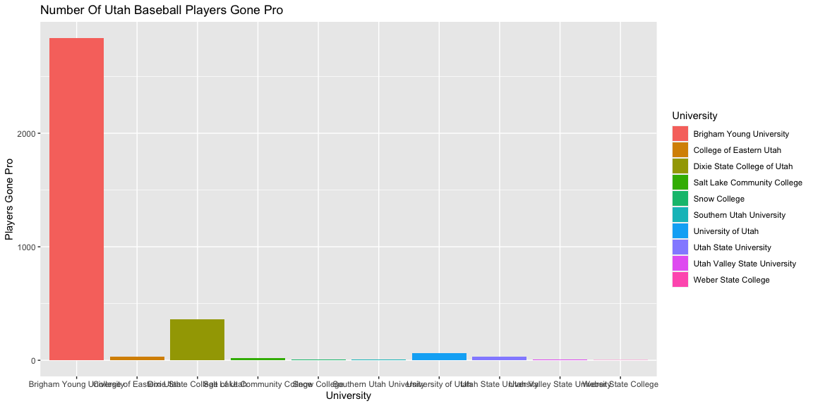
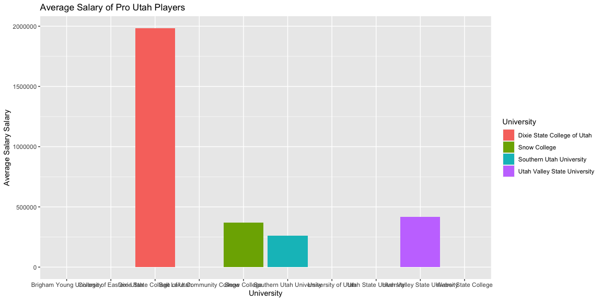

```r
# Use this R-Chunk to import all your datasets!
#[ ] Take notes on your reading of the specified ‘R for Data Science’ chapter in the README.md or in a ‘.R’ script in the class task folder
#[ ] Install the library(Lahman) and examine the available data sets available
#[ ] Find the 4-5 different data sets that you will need to show
#full college and player names as well as their annual earnings
#[ ] Install the library(blscrapeR) and use the inflation_adjust(2017) function to get all earnings in 2017 dollars
#[ ] Make a plot showing how professional baseball player earnings that played baseball at BYU compared to the players from other Utah schools
#[ ] Save your .R script and image to your repository and be ready to share your code and image at the beginning of class


#OOHHH okay.  So compare BYU playesr to all over UTah players got it. okay.  
```

## Background

Is BYU The Best School in Utah for going Pro in Baseball?

## Data Wrangling


```r
# Use this R-Chunk to clean & wrangle your data!


BB<-left_join(Batting,CollegePlaying, by="playerID")
BB<-left_join(BB,Schools, by="schoolID")
BB<-left_join(BB,Salaries,by="playerID")
UT<-BB %>% filter(state=="UT")
```

## Data Visualization


```r
# Use this R-Chunk to plot & visualize your data!

library(pander)

ggplot(data=UT, aes(x=as.factor(name_full),y=salary,color=name_full))+geom_point()+geom_point(aes(x=name_full,y=mean(salary), color="black"))+
  labs(color="University", x="University", y="Salary",title="Utah Baseball Players Going Pro Salaries")
```

<!-- -->

```r
library(ggbeeswarm)
 
   ggplot(UT, aes(x=factor(name_full), y=salary), color = name_full)+
     geom_quasirandom(aes(color=name_full)) +
     stat_summary(fun="mean", geom="point", size=4)+
     labs(color="University", x="University", y="Salary",title="Utah Baseball Players Going Pro Salaries")
```

<!-- -->

```r
UTS<-UT %>% group_by(name_full) %>% summarise(Average_Salary=mean(salary), Number_Of_Players_Gone_Pro=n()) 

ggplot(UTS, aes(x=name_full, y=Number_Of_Players_Gone_Pro, fill=name_full))+geom_col()+
  labs(x="University", y="Players Gone Pro", title="Number Of Utah Baseball Players Gone Pro",fill="University")
```

<!-- -->

```r
ggplot(UTS, aes(x=name_full, y=Average_Salary, fill=name_full))+geom_col()+
  labs(x="University", y="Average Salary Salary", title="Average Salary of Pro Utah Players",fill="University")
```

<!-- -->

## Conclusions

The Reality is while there are an overwhelming higher nuber of Players from BYU that go Pro, (meaning they dont persue other careers ;) there is no hire average salary, indeed it looks as if there is there is on average a slightly lower average salary.

It could be disected by year and player. But appears that among BYU players only on player is skewing the results as the highest outlier and even with this BYU is lower than Dixie states average.

Granted BYU has more players.  Overwhelmingly which counts for something, they also have the highest paid players by far, in terms of how high salary goes.  However, on average Dixie stat has a higher average salary by a few thousand.  That said, there are so many fewer players.

I am curious if the Data is counting duplicate salaries of the players.This Doesnt Seem the be case as the GGSwarm doesnt have more than one point for 90,000 salary however, I havent given anything to group by player in additon to school, which is possible.


So in conclusion, BYU does produce the highest number of players to go Pro but if you were to look only at average salary you would choose Dixie, even if they you have a smaller chance of going pro, the trend is you would make slightly more money on average even if its smaller.


```r
UTS2<-UT %>% group_by(name_full,playerID) %>% summarise(Average_Salary=mean(salary), Number_Of_Players_Gone_Pro=n()) 
```


