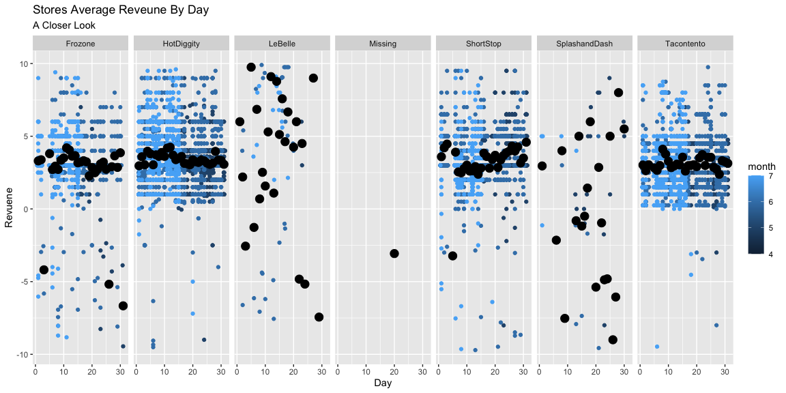

```r
# Use this R-Chunk to import all your datasets!
#provide daily, weekly, and monthly gross revenue summaries and comparisons.
bob<-tempfile()
  download("https://byuistats.github.io/M335/data/sales.csv", bob, mode="wb")

biz<-read_csv(bob)
```

## Background

Download

## Data Wrangling


```r
# Use this R-Chunk to clean & wrangle your data!

#force into the same time zone

biz1<-biz %>% force_tz(time, tzone="MST7MDT")


biz1<-biz1 %>% mutate(hour=hour(Time))
biz1<-biz1 %>% mutate(month=month(Time))
biz1<-biz1 %>% mutate(day=day(Time))
biz1<-biz1 %>% mutate(week=week(Time))

## Then group
```

## Data Visualization


```r
# Use this R-Chunk to plot & visualize your data!

biz1 %>% ggplot(mapping=aes(x=month, y=Amount))+geom_point()+facet_grid(~Name)
```

<!-- -->

```r
library(ggbeeswarm)
 
   
  
   
     
   ggplot(biz1, aes(x=month, y=Amount), color = month)+
     geom_quasirandom(aes(color=month)) +
     stat_summary(fun="mean", geom="point", size=4)+
     labs(color="month", x="Month", y="Revuene",title="Stores Average Reveune", subtitle="By Month")+facet_grid(~Name)
```

<!-- -->

As we can see here the overwhelming Majority of the data is clustered around the zero mark on the Y Axis.  


```r
     biz1 %>% filter(Amount<10 & Amount>-10) %>% ggplot(aes(x=month, y=Amount), color = as.factor(month))+
     geom_quasirandom(aes(color=month)) +
     stat_summary(fun="mean", geom="point", size=4)+
     labs(color="month", x="Month", y="Revuene",title="Stores Average Reveune By Month", subtitle="A Closer Look")+facet_grid(~Name)   
```

<!-- -->

```r
  biz1 %>% filter(Amount<5 & Amount>-5) %>% ggplot(aes(x=month, y=Amount), color = month)+
     geom_quasirandom(aes(color=month)) +
     stat_summary(fun="mean", geom="point", size=4)+
     labs(color="month", x="Month", y="Revuene",title="An Even Closer Look") +facet_grid(~Name)     
```

<!-- -->

By Elimanting some Massive Outliers by one store with a single case of $4000 at sale which is of note, but isnt a tpyical or repeated point of sale without.  If the store is not preforming well normally on its own a single outlier does not characterize what can be expected of the store on a normal basis.  Thus while important it shoud not be included in the Monthly preformance.  This said there is more to this picture.  Lets take a look at what more there is.


```r
     biz1 %>% filter(Amount<10 & Amount>-10) %>% ggplot(aes(x=week, y=Amount), color = as.factor(month))+
     geom_quasirandom(aes(color=month)) +
     stat_summary(fun="mean", geom="point", size=4)+
     labs(color="month", x="Week", y="Revuene",title="Stores Average Reveune By Week", subtitle="A Closer Look")+facet_grid(~Name)   
```

<!-- -->

From the Week perspective, LeBelle seems to have the highest average preformances but has also the lowest loses on average.


```r
     biz1 %>% filter(Amount<10 & Amount>-10) %>% ggplot(aes(x=day, y=Amount), color = as.factor(month))+
     geom_quasirandom(aes(color=month)) +
     stat_summary(fun="mean", geom="point", size=4)+
     labs(color="month", x="Day", y="Revuene",title="Stores Average Reveune By Day", subtitle="A Closer Look")+facet_grid(~Name)   
```

<!-- -->

From a daily perspective any partern becomes much more difficult to discern
A daily look seems to reveal no pattern or negative trends.  For example HotDiggty which to this point was.

The Best investment is HotDiggity it has shown the most consistnet month growth and to the highest degree.


```r
     biz1 %>% filter(Amount<10 & Amount>-10) %>% ggplot(aes(x=hour, y=Amount), color = as.factor(month))+
     geom_quasirandom(aes(color=month)) +
     stat_summary(fun="mean", geom="point", size=4)+
     labs(color="month", x="Day", y="Revuene",title="Stores Average Reveune By Hour", subtitle="A Closer Look")+facet_grid(~Name)   
```

<!-- -->

Reveune seems to drop off hourly as we grow closer to the days close.  after 8:00 is the drop is the most profound.  But even at 3:00.  A store closing before 5:00 would be unheard of but before 8:00 would not be the worst option.  


## Conclusions
